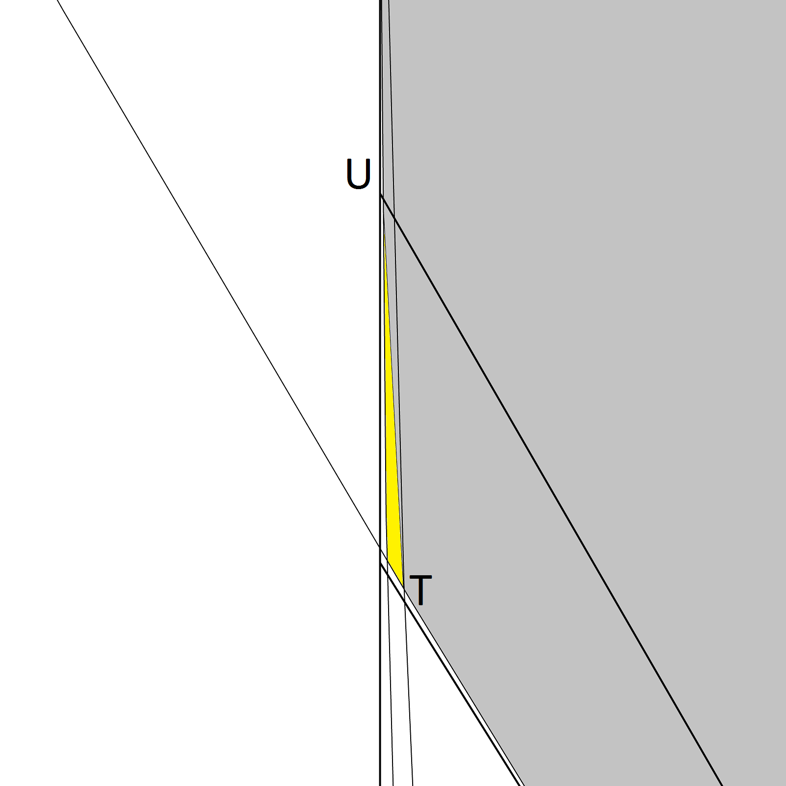

The aim of this text is to define a universal cover which could be minimal, Beware that the initial attempt is not likely to be minimal and will probably require further refinements.

# Slanted Cover
It was shown (Baez, Bagdasaryan, Gibbs 2015) that a hexagon with two corners removed (_C_ and _E_ in figure 1) by the edges of the hexagon rotated through 30 degrees plus some slant angle _σ_ is a universal cover. It is also conjectured (Gibbs 2014) that the universal cover of least area is contained within this form for some value of slant angle. The case of zero slant angle σ was explored by Pal, Sprague and Hansen but the new results suggest that a small non-zero angle is in fact optimal. 

The sections below discribe five regions to remove from the slanted Pal cover in order to reduce it to what may be the optimal solution.

Diagrams are drawn with a slant angle of 7 degree unless otherwise stated. This is larger than the optimal slant angle around 1.5 degree.

#### Figure 1

### Removal of region _Ci_ near point _C_2 
Draw an arc of radius 1 centred on _F_3 touching the line segement _C_3_C_2 at the point _K_ and intersecting the line segment _C_2_D_3 at the point _G_ (see figure 2.) Remove the area _GKC_2 bounded by the arc _GK_ and straight lines _GC_2 and _KC_2

##### Figure 2

### Removal of region _Ei_ near point _E_2 
Draw an arc of radius 1 centred on _C_3 touching the line segment _F_3_E_2 at _H_ Draw a second arc of radius 1 centred on _B_3 touching the line segment _E_2_E_3 at _I_ Let _J_ be the point of intersection of the two arcs (see figure 3.) The region _HJIE_2 bounded by the two arcs and two straight edges can be removed.

##### Figure 3

### Removal of region _Eii_ near point _E_2 
More area can be removed from near _E_2. The following construction is applicable for slant angles less than 10 degrees. Let _R_ be the intersection of the line segment _F_2_F_3 with the centre line _F_1_C_1. For slant angles less than 10 degrees the distance from _R_ to _C_3 is less than 1. An arc of radius 1 centred on _R_ will therefore intersect the line segement _C_3_B_2 at a point _S_. An arc centred on _S_ intersects the arc _JI_ at a point _T_.(see figure 4)

##### Figure 4

Consider the edge of the regular dodecahedron that would remove the triangle near _E_ is the slant angle were zero. This line would cut the arc _HJ_ at a point _U_  

The straight line _TU_ can now be used to remove an extra region _TUJ_. This is shown highly zoomed in figure 5 which has been drawn with a slant angle of 2.0 degree for better clarity.

##### Figure 5

### Removal of region _Ai_ near point _A_ 

