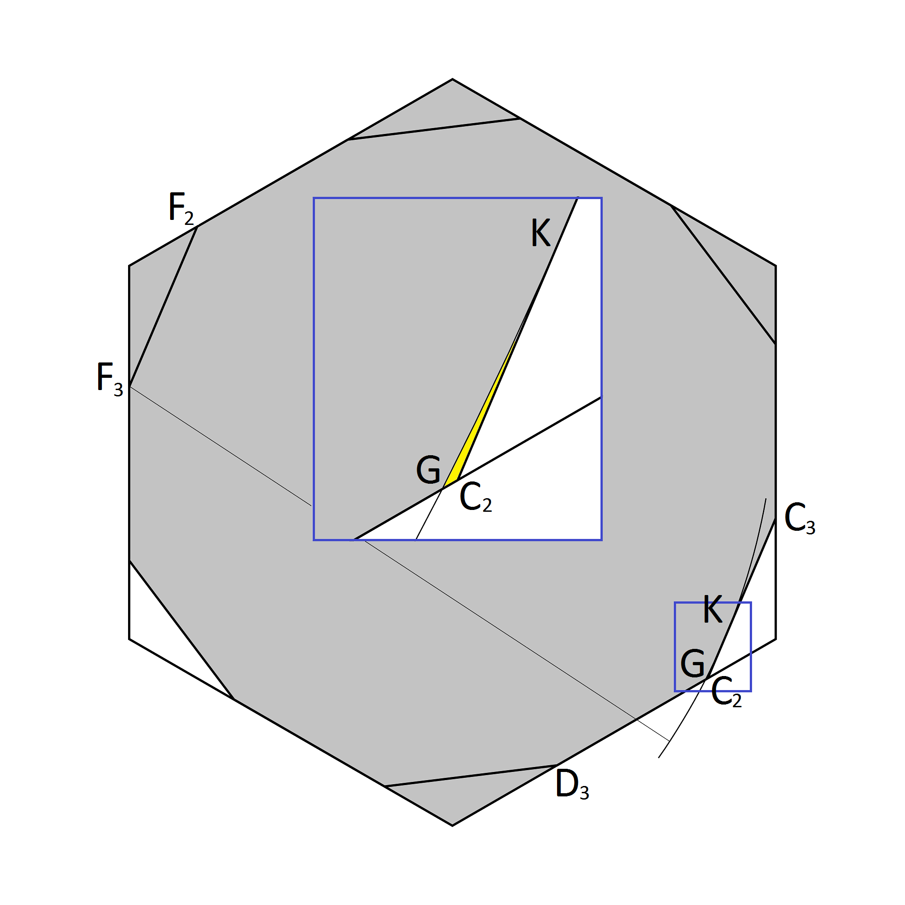
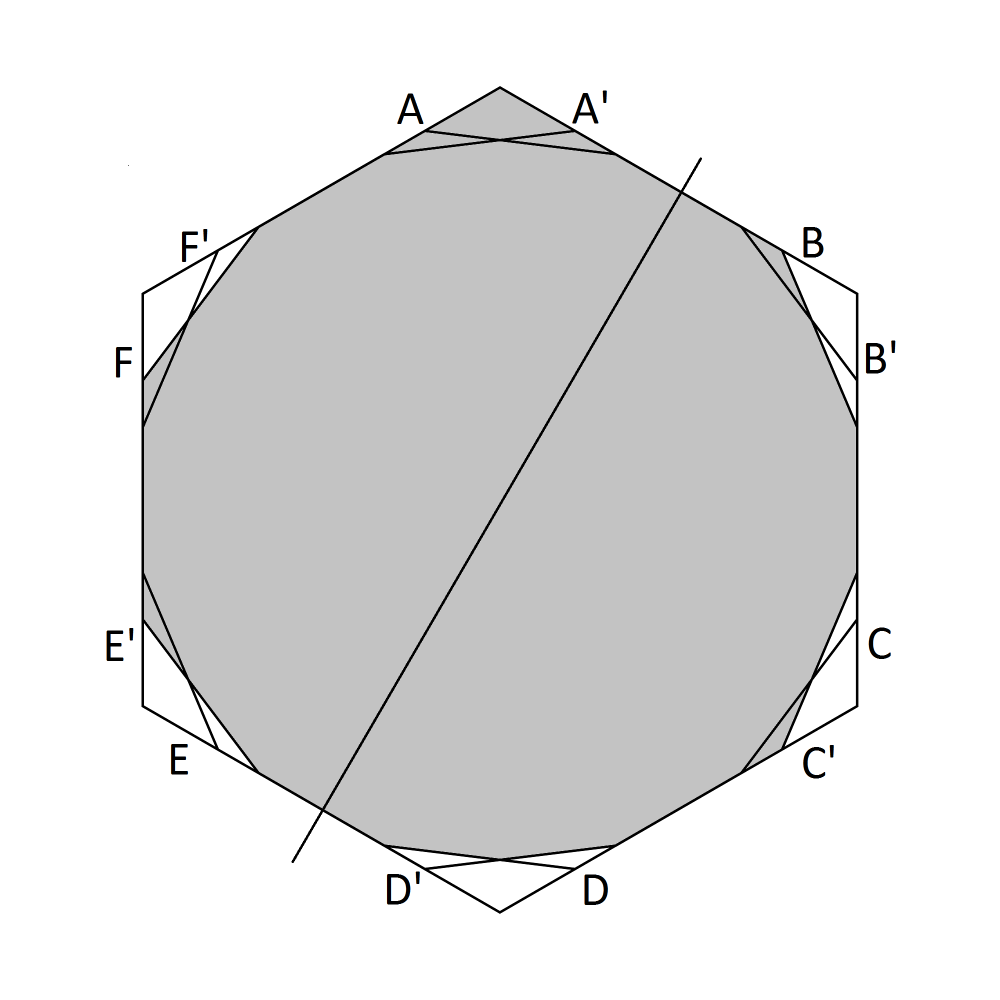
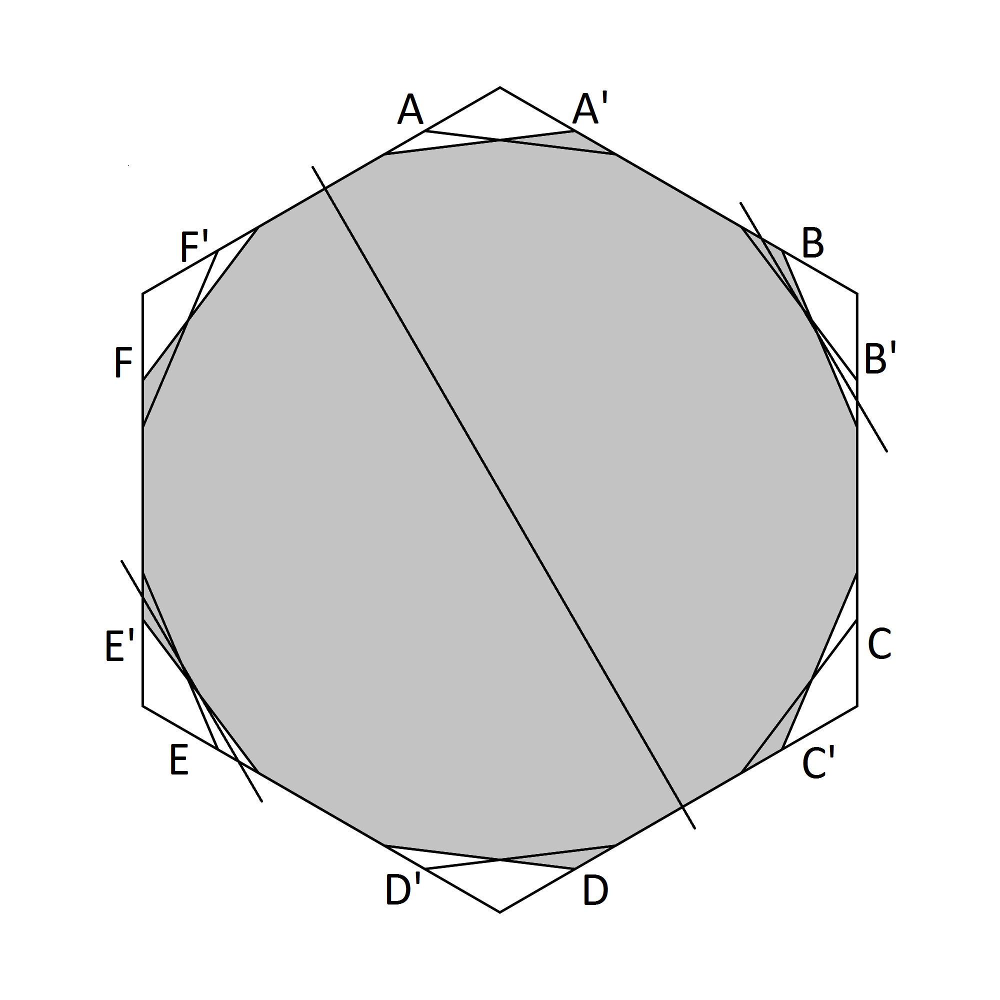
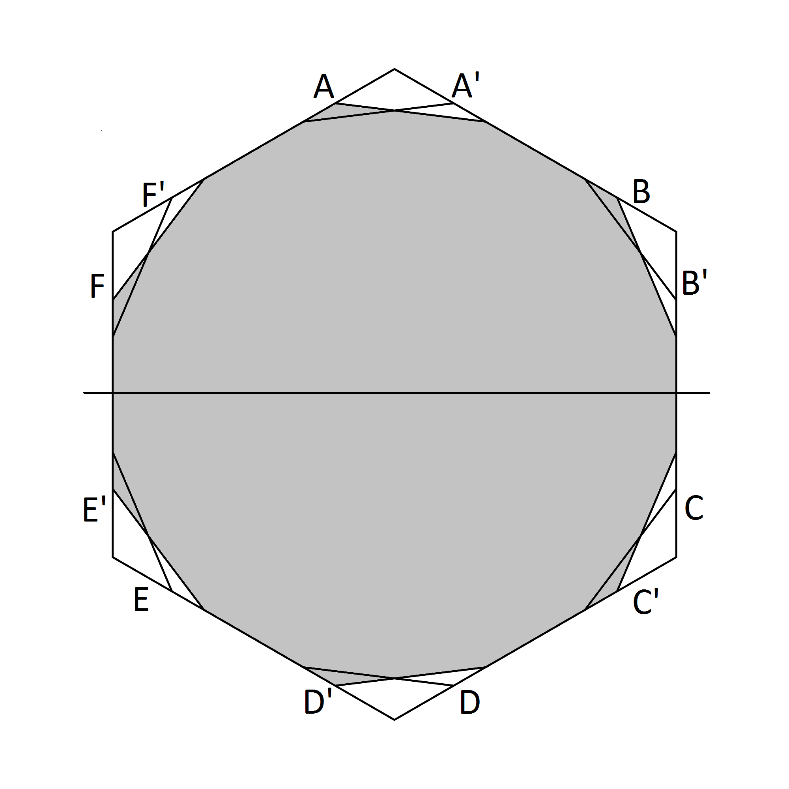
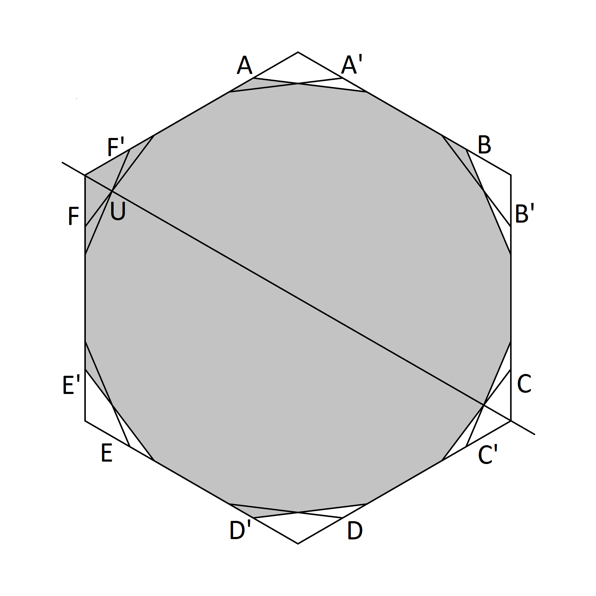

In [cover](cover.md) a shape was defined as a function of the slant angle _σ_. 
In this document that shape is proven to be a universal cover for all shapes of diameter one.
This sets an upper limit on the area for the least universal cover.

### Preliminaries

The first step is to show that every shape of diameter one can be contained within a curve of constant width one.
This was proven in (Pál 1920) see also (Vrecica 1981). This implies that it is sufficient to show that the defined
shape contains any curve of constant width to prove that it therefore contains every shape of diameter one.

The second step is to show that the regular hexagon with two corners removed at a slant angle is a universal cover (see figure 1)
This was proven in (Baez, Bagdasaryan, Gibbs 2015)

##### Figure 1

In the definition of the proposed cover five peices were removed from the slanted cover. It is sufficient to show 
that any curve of constant width can be placed within the cover in such a way that it avoids these five areas. 
For the first three areas named _Ci_, _Ei_ and _Ai_ it will be shown that any curve of constant width placed inside the 
slanted cover cannot enter these areas. For the remaining two areas _Eii_ and _Aii_ it will then be shown that a position 
for any such curve can be found using reflections and rotations that ensure the curve avoids both these areas. The proof
will then be complete.

### Removal of Region _Ci_

##### Figure 2

A curve of constant width one placed inside the slanted cover cannot enter the interior of region _Ci_. To see this observe that no point on the curve can outisde the line _C_2_C_3 (see figure 2) Since it has constant width one this means that it must cross or touch the line segment _F_2_F_3. All points in the region _Ci_ are outside the arc of radius one centred on _F_3 and the angle _F_2_F_3K is a right angle. Therefore all points in the interior of region _Ci_ are at a distance greater than one from all points on the segment _F_2_F_3. This proves the desired result.

### Removal of Region _Ei_

##### Figure 3

The argument for removal of region _Ei_ is similar except that there are two arcs involved. A curve of constant width placed inside the slant cover must touch the edge along line segment _C_2_B_1. Points inside _Ei_ which are outside the arc of radius one centred on _C_3 are more than a distance one from this segment so the curve cannot intersect there. The curve must also cross or toch the line segment _B_3_B_2 which excludes points beyond the arc of radius one centred on _B_3. The combination of these two exclusions confirms that the curve cannot entre the interior of region _Ei_.

### Removal of Region _Ai_

##### Figure 6

Again the argument for removal of region _Ai_ is similar. A curve of constant width placed insode the slanted cover will touch line segments _E_3_D_1 and _D_1_G_ This means that it cannot enter the region _Ai_ since all points in that region are a distance greater than one from all points on at least one of these segments.

### Removal of Regions _Eii_ and _Aii_

To show that the remaining two regions _Eii_ amd _Aii_ can be removed a more complex case-by-case argument is needed. The freedom to reflect shapes will be used for the first time.

##### Figure 8

Triangular areas _A_, _B_, _C_, _D_, _E_, _F_ near the corners of the hexagon are defined at a slope angle _σ_ as before. In addition areas _A'_, _B'_, _C'_, _D'_, _E'_, _F'_ are defined for a negative slope angle _-σ_ (see figure 8) The slanted area is defined by removing triangles _C_ and _E_ from the hexagon. We know that any curve of constant width placed inside this slanted region cannot enter the interior of _Ci_, _Ei_ or _Ai_. It is also the case that it cannot enter the interior of both _A_ and _D_, or both _A'_ and _D'_, or both _E'_ and _B'_, or both _C'_ and _F'_. So each placement of the curve will fall into one of 16 cases according to these 4 binary choices (Note that it may fall into more than one case if it touches two opposing areas without entering the interior of either but these do not need to be considered as extra cases) Figure 12 shows all 16 cases.

##### Figure 12

The sixteen cases will be labelled according to the four areas that the curve enters the interior of e.g. _F'B'AD'_ means the case where it must enter the triangles  _F'_,_B'_, _A_, _D'_

### Cases where curve cannot enter the two regions

First we will deal with simple cases where no reflections are required. The region _Aii_ is entirely within the area _A_. If curve does not enter the _A'_ then it enters _D'_. If an arc is drawn from the corner of this region an extra area area can be added to _A'_ in the same way that the area _Ci_ was added to _C_. When _A'_ is extended in this was _Aii_ will always be insde that area. The region _Eii_ is entirely wihtin the area _E'_. Therefore any cases where the curve does not pass within the interior of _E'_ and not within the area of either _A_ or _A'_ then the curve is covered for this case. This is true for 6 of the 16 cases where it enters _D'_ or _D_ and _B'_, i.e. cases _F'B'AD'_, _F'B'DD'_, _C'B'AD'_, _C'B'DD'_, _F'B'DA'_ and _C'B'DA'_. 

##### Figure 11

If the curve does not enter _C'_ then it cannot enter the region out side the arc centred on _L_ near _A_. Again this includes _Aii_ therefore the case _F'B'DD'_ is also eliminated (Figure 11).

### Unconditional rotation cases

In cases where the curve enters _D_ so that it is excluded from _A_ the curve can be rotated through angles of 120 degrees or 240 degrees without entering the removed traingles _C_ and _E_. In three further cases this can be used to reposition the curve so that it does not enter _E'_ while _A_ also remains clear. This eliminates _F'E'DA'_ (rotate 120 degrees clockwise), _C'E'DD'_ rotate (120 degrees anti-clockwise), _F'E'DD'_ (rotate 120 degrees in either direction) 

### Unconditional reflection case

##### Figure 13

In case _C'E'AA'_ the curve can be reflected about the centre line through the midpoint of the side of the hexagon _AB_ and the midpoint of the side _ED_. This tranforms it to the case _C'B'DA'_ which is already eliminated (see figure 13)

### Conditional reflection cases

The remaining five cases are more difficult to deal with but each one has an axis of symmetry so the curve can be reflected freely through this axis. What we need to show is that if the curve enters the interior of regions _Aii_ or _Eii_ then after reflection about the axis it will no longer do so. 

##### Figure 14

Case _C'E'DA'_ is shown in figure 14. The area in which the curve lies has a reflection symmetry about the line through the midpoint of sides _FA_ and _DC_. Two extra lines are drawn parrallel to this line at a distance of one half to either side of it. Since the distance between these lines is one, a curve of constant width one can only go outside one of these lines. The region _Eii_ lies outside the line that runs near _E_. If the curve goes outside this line it can be reflected through the midline and will then not cross the line. In this way it is possible to ensure that it does not enter _Eii_. Whether reflected or not it does not enter the region _A_ which includes _Aii_. This completes the argument for this case. 

Case _FE'AA'_ has the same axis of symmetry as _C'E'DA'_ and the same argument shows that the curve can be reflected to ensure that it avoids the interior of _Eii_. It also avoids _Aii_ because it does not enter the interior of _C'_. 

##### Figure 15

Case _C'E'AD'_ has a reflection symmetry about a line through the midpoints of sides _EF_ and _CB_. A curve of constant width will touch the side _CB_ at some unique point. If it touches nearer to the corner at _C_ than the corner of _B_ then reflect the curve about the line. The curve will then touch nearer _B_ and _C_. No point on the curve can then be outside the arc of radius one centred on the midpoint of _CB_ and below the line of reflection. The region _Eii_ is enitrely outside this line. The curve also does not enter the region _Aii_ because it is exlcuded from _A'_ for this case.

##### Figure 16

Case _F'E'AD'_ has a reflection symmetry about a line through the corners at _F_ and _C_ 

