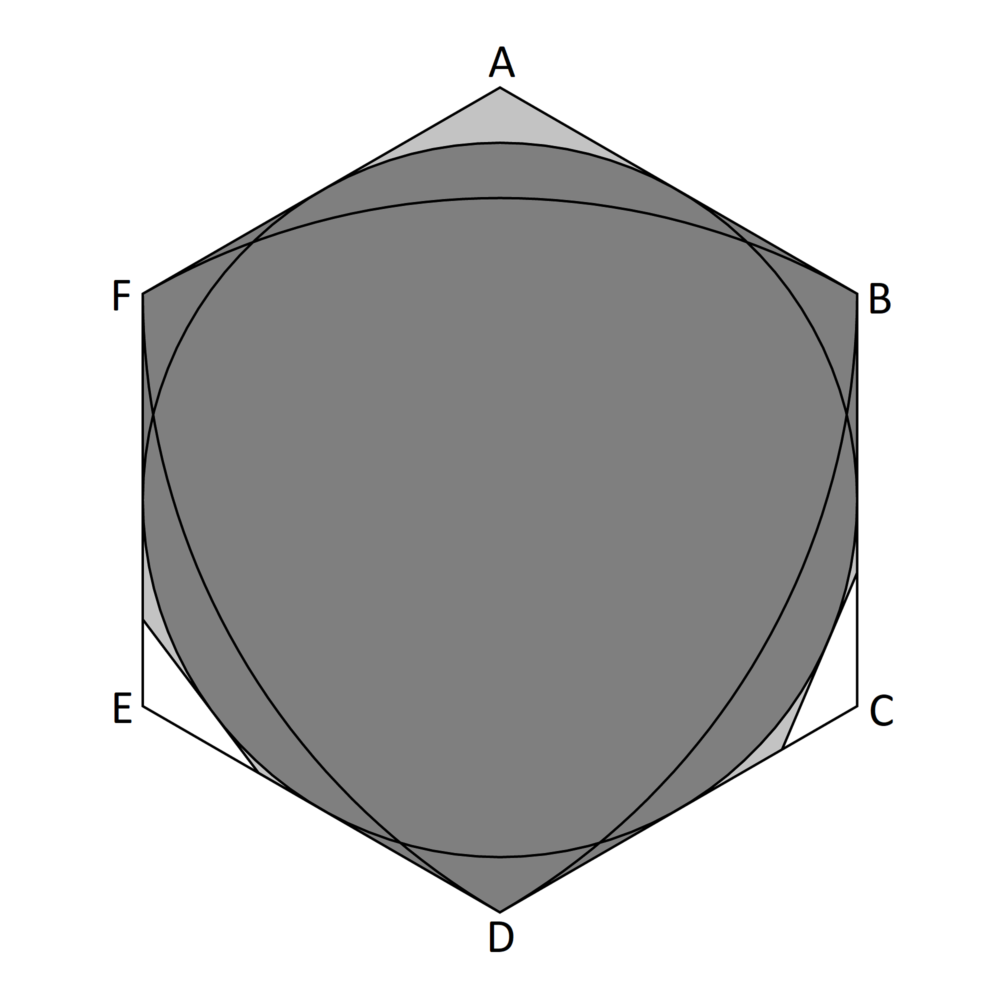
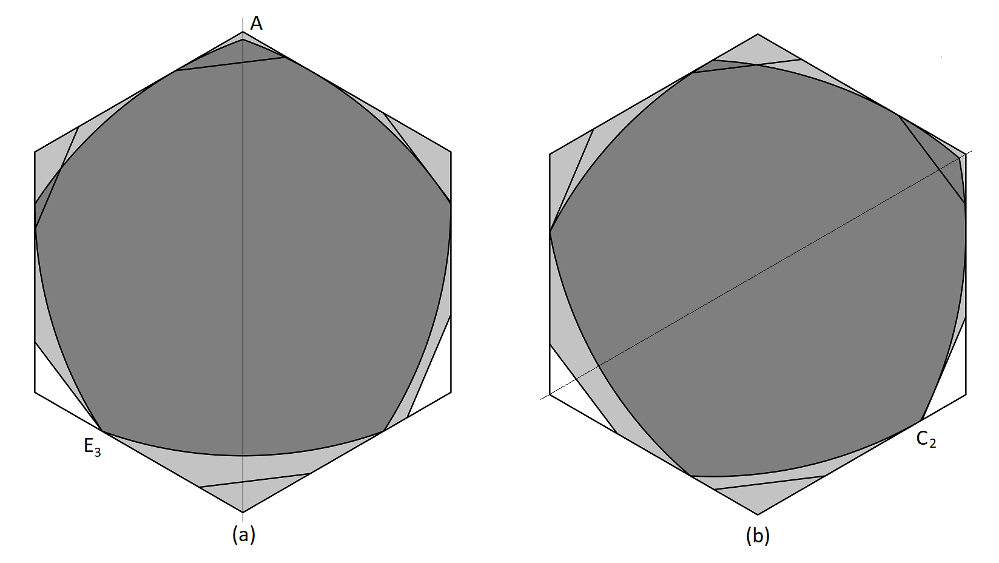
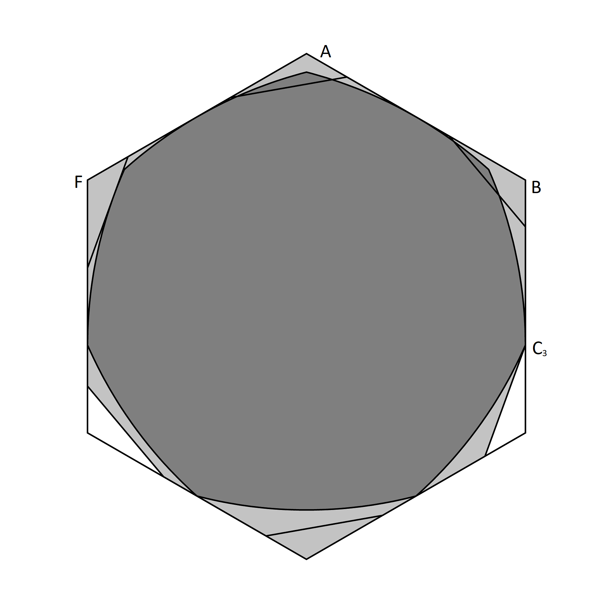

### Introduction

The task of defining rigorously proven upper limits for the area of Lebesgue's Universal Cover has proven relatively tractable. 
There is even hope that this process is converging or even has converged on the optimal solution. In contrast, the problem of
proving lower limits is still unaproachable except up to a point which appears to be well below optimal. However, it may be 
possible to establish better lower limits if the right hypothesis is assumed. E.g. we may assume that the optimal cover is
a subset of the basic slanted cover. The gap of establishing the validity of that assumption could then be closed later.
Even this goal remains ambitious but a first step would be to define a minimal set of curves of constant width that would
fill the conjectured optimal cover. That is what will be attempted here. Apart from the eventual possibility of proving 
a lower limit, conditional or otherwise, the more immediate motivation for doing this is to uncover any further scope for
bringing down the upper limit.

The shape we will assume is the regular hexagon with two corners removed at _C_ and _E_ at a slant angle _σ_ (see figure 1). This shape will be referred to as 𝒫(_σ_) or just 𝒫.

##### Figure 1

## Critial Curves

### Reuleaux Triangle and Circle 

The Reuleaux triangle and the circle can only be fitted into 𝒫 in one way as shown in figure 17. The convex hull (dark grey)
of these two shapes must be part of any cover contained in this area. Therefore no regions can be removed near the corners
_B_, _D_ or _F_. Only the light grey areas have possibilities for reduction of the area. This sets a lower bound for the minimal cover within 𝒫, but it is no better than the general lower bound given by these two shapes.

##### Figure 17

### Other Shapes with Unique Fit.

To improve the conditional lower bound we can look for other curves of constant width that fit into 𝒫 in a unique way. The convex hull of all such shapes when fitted will set a new conditional lower bound (i.e. conditional on the assumption that the universal cover of least area fits inside 𝒫(_σ_).)

Recall that any curve of constant width can be placed within 𝒫 using rotations and translations only. Reflections are not necessary to achiev the fit (Baez, Bagdasaryan, Gibbs 2015.) However, reflections are allowed in general and must be counted when considering the number of ways a curve would fit into 𝒫. A curve and its reflection would fit into 𝒫 without further relfections, therefore there will be at least two ways to make the fit, unless the curve has a reflection symmetry.

Curves of constant width can also have a rotation symmetry which must either be of odd order or infinite order (in the case of the circle.) These are special cases that must be considered separately. 

Curves without any rotation symmetry can be fitted into a regular hexagon in _f_ = 6 _k_ ways. This must be a multiple of six because rotations through 60 degrees will provide distinct fits into the hexagon. This six-fold rotational freedom is sufficient to enable a fit inside 𝒫. Therefore the fit can only be unique for curves with no rotation symmetry if _k_ = 1 and _f_ = 6.

Furthermore, once the shape is fitted into the hexagin, there are two main cases to consider according to how the curve enters the cornerareas of the hexagon as shown in figure 1. They may enter three consecutive corners such as _A_, _B_ and _C_. In this case there is a unique way to use the 6 fold rotations to avoid the corners _C_ and _E_ as required. If however, the curve enters three corners such as _A_, _C_ and _E_ that are not consecutive, then there are three ways to rotate avoiding _C_ and _E_ (because we assume the curve does not have rotational symmetry.) Other cases are possible where the curve touches the boundary of the corners but does not enter their interior. In these cases there are also multiple fits. In conclusion, a unique fit is possible only when it enters the interior of three conscutive corner regions.

In summary, a curve of constant width with no rotational symmetry will have a unique fit inside 𝒫 iff all three of the followinf conditions are met:
* The curve has a reflection symmetry.
* The curve fits into the regular hexagon in exactly six ways.
* When fitted into the hexagon it enters the interior of three of the six corner regions cut at the slant angle _σ_ such that these are at consecutive corners round the hexagon.

Only the third condition depends on the slant angle _σ_.

### Reuleaux Pentagons with Unique Fits

Consider next these conditions applied to a Reuleaux pentagon which is a closed curve composed of five arcs of radius one such that the centres of the arcs coincide with the vertices where the arcs meet. The five angles form a cyclic 5-tuple (_θ_1,_θ_2,_θ_3,_θ_4,_θ_5). Only two of these angles can be independently varied. To impose reflection symmetry the angles can be written as (_θ_1,_θ_2,_θ_3,_θ_2,_θ_1) and only one angle is independent. The full set of Reuleaux pentagons with reflection symmetry forms a one parameter family interpolating between (30°,60°,0°,60°,30°) and (60°,0°,60°,0°,60°) where both ends degenerate into the Reuleaux triangle. Apart from the endpoints only the regular Reuleaux pentagon (36°,36°,36°,36°,36°) has a rotational symmetry and must be considered as a special case. 

The next step is to determine which of these curves fits into the regular hexagon in exactly six ways. This can be done numerically using the computational methods described in (Gibbs 2014). The result is that all pentagons have 6 fits except for a small range given by 34.411° < _θ_1 < 36.318°.

##### Figure 18

The only Reuleaux pentagon we need to look at is the one shown in figure 18. With its line of reflection symmetry set vertically it is determined by the requirement that it has a vertex at the point _E_3 as shown in fig 18(a). This means that it touches both corner regions _B_ and _E_ without entering the interiors of either. It can therefore also be rotated through 60 degrees as shown in fig 18(b). Provided the slant angle is less than 12 degrees the angle _θ_1 is greater than 36.318° so these two positions are the only ways in which it fits inside 𝒫. If the angle _θ_1 is decreased by an arbitrarily small amount the aymmetric Reuleaux pentagon fits inside 𝒫 in only position (a) while if it is similarly increased it fits only in position (b). This means that a universal cover contained within 𝒫 must include this pentagon in both these positions.

These pentagons show that the cover must include the point _E_3. They also reduce the area that can be removed near _A_ while the area near _C_2 that can be removed coincides with the area _Ci_ that was shown to be removable when setting the upper bound.

### Reuleaux Septagons

A Reuleaux septagon with an axis of symmetry can be placed in the hexagon so that the axis is verticle with a vertex at the top. It is then determined by where it touches the sides _AB_ and _BC_. Figure 19 shows such a septagon touching the midpoint of _AB_ and the point _C_3 on _BC_. The curve will enter the interior of _A_ and _B_ except in the case of very small or large slant angles. It also touches _F_ and can be made to enter _F_ by moving the point where it touches _BC_ up by an arbitrary small amount. This ensures that it fits uniquely into the area 𝒫.

This curve therefore shows that the point _C_3 cannot be removed from a cover contained in 𝒫. It also limits the area that can be removed near _E_2.

##### Figure 19

