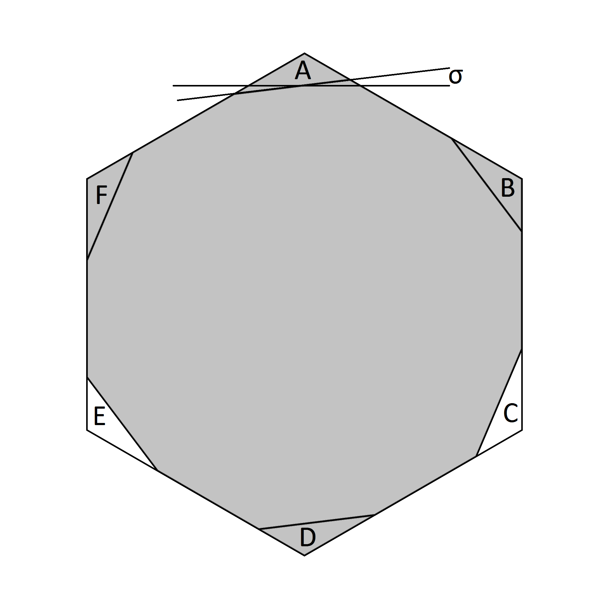

### Introduction

The task of defining rigorously proven upper limits for the area of Lebesgue's Universal Cover has proven relatively tractable. 
There is even hope that this process is converging or even has converged on the optimal solution. In contrast, the problem of
proving lower limits is still unaproachable except up to a point which appears to be well below optimal. However, it may be 
possible to establish better lower limits if the right hypothesis is assumed. E.g. we may assume that the optimal cover is
a subset of the basic slanted cover. The gap of establishing the validity of that assumption could then be closed later.
Even this goal remains ambitious but a first step would be to define a minimal set of curves of constant width that would
fill the conjectured optimal cover. That is what will be attempted here. Apart from the eventual possibility of proving 
a lower limit, conditional or otherwise, the more immediate motivation for doing this is to uncover any further scope for
bringing down the upper limit.

The shape we will assume is the regular hexagon with two corners removed at _C_ and _E_ at a slant angle _σ_ (see figure 1).

##### Figure 1

## Critial Curves

### Roueleux Triangle and circle 

The roueleux triangle and the circle can only be fitted into this shape in one way as shown in figure 17. The convex hull (dark grey)
of these two shapes must be part of any cover contained in this area. Therefore no regions can be removed near the corners
_B_, _D_ or _F_. Only the light grey areas have possibilities for reduction of the area

##### Figure 17

### Critical Roueleux Pentagons

